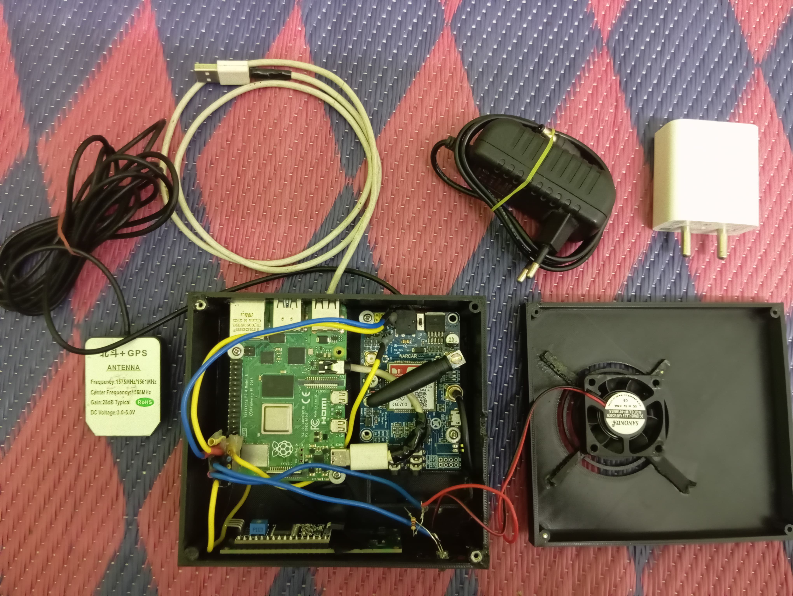
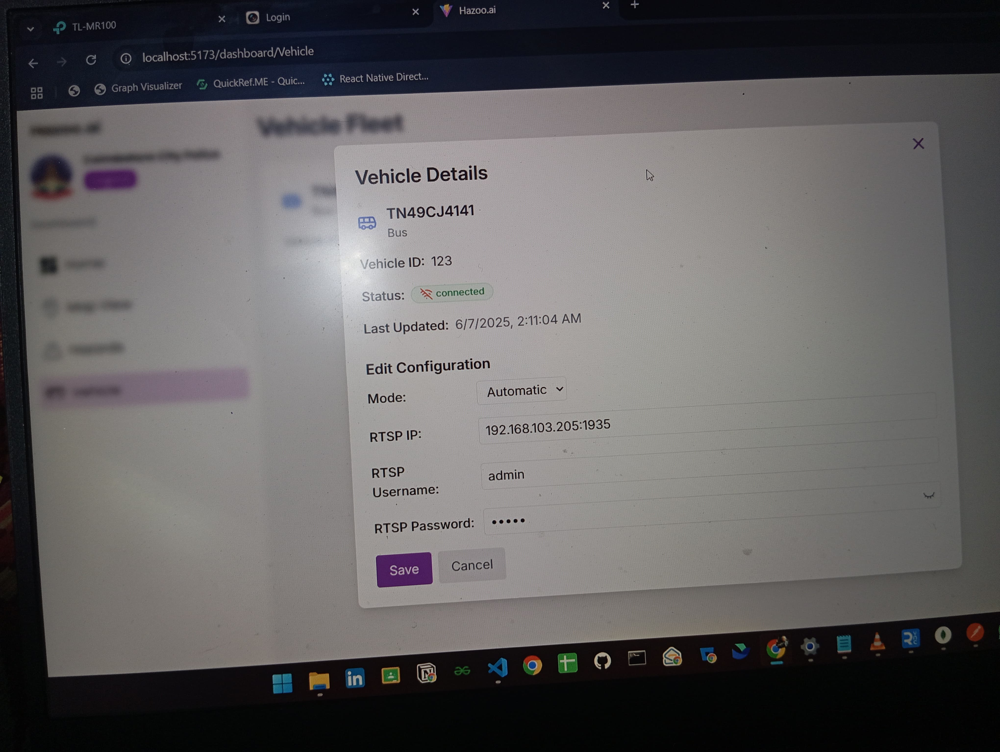
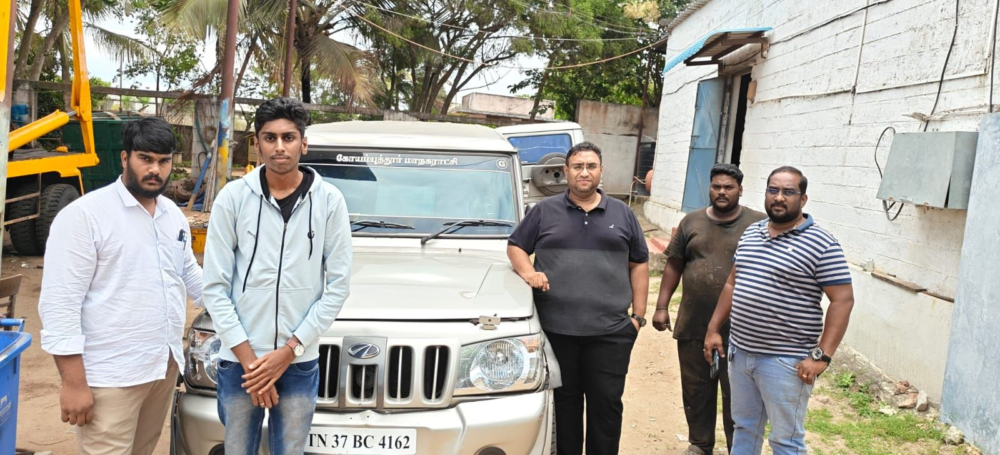

# Hazoo.ai - Deep Learning Based Road Hazard Detection IoT Kit

> A comprehensive platform combining hardware IoT kit, web dashboard, and mobile app for government officials and citizens to collaborate on community road hazard detection and reporting.

**Best Project Award** - Uyir Hackathon 2025 🏆

---

## Table of Contents

- [Overview](#overview)
- [Features](#features)
- [Hardware IoT Kit](#hardware-iot-kit)
- [Web Dashboard](#web-dashboard)
- [Mobile App](#mobile-app)
- [Technology Stack](#technology-stack)
- [Project Structure](#project-structure)

---

## Overview

Hazoo.ai is a deep learning-based road hazard detection system that bridges the gap between technology and community safety. The platform provides:

- **IoT Hardware Kit**: Real-time hazard detection using computer vision in government vehicles
- **Web Dashboard**: Comprehensive management and analytics platform for government officials
- **Mobile App**: Community-driven hazard reporting system for citizens

The system leverages advanced computer vision techniques to identify potential hazards such as potholes, debris, and road obstacles, enabling proactive infrastructure maintenance and enhanced road safety.

---

## Features

### Hardware IoT Kit

- Real-time hazard detection for government vehicles
- RTSP Stream & USB Stream support
- Integrated deep learning model deployment
- Pilot-tested in Coimbatore Corporation vehicles

### Web Dashboard

- Real-time hazard monitoring and visualization
- Interactive map interface
- Analytics and reporting tools
- User and vehicle management

### Mobile App

- Citizen hazard reporting system
- Real-time map integration
- User authentication and profile management
- Coin-based reward system

---

## Hardware IoT Kit

The IoT hardware kit can be fixed in government vehicles for real-time hazard detection.

**Hardware Kit** - Compact embedded system designed for vehicle integration


**Dashboard Interface** - Real-time camera configuration with RTSP and USB stream support


**Pilot Testing** - System deployed and tested in Coimbatore Corporation vehicles


**Award Recognition** - Best Project Award at Uyir Hackathon 2025


---

## Web Dashboard

Administrative interface for government officials to monitor and manage hazards.


**Map Interface** - Interactive geographic visualization of reported hazards and vehicle locations


**Hazards Management** - Detailed list and management interface for reported road hazards


---

## Mobile App

Community reporting application for citizens to contribute to road safety.

<div style="display: flex; gap: 20px; margin: 20px 0; flex-wrap: wrap;">
  <div>
    <p><strong>Login Screen</strong> - User authentication and secure access portal</p>
    
  </div>
  <div>
    <p><strong>Home Screen</strong> - Main dashboard with quick access to reporting and navigation features</p>
    
  </div>
  <div>
    <p><strong>Map Screen</strong> - Real-time hazard locations and navigation interface</p>
    
  </div>
</div>

---

## Technology Stack

### Backend

- **Runtime**: Node.js
- **Framework**: Express.js
- **Database**: MongoDB
- **API**: RESTful architecture

### Frontend (Web)

- **Framework**: React with Vite
- **Styling**: Tailwind CSS
- **Build Tool**: Vite
- **Deployment**: Vercel

### Mobile App

- **Framework**: React Native
- **Language**: TypeScript
- **Build**: Metro bundler

### Hardware & ML

- **Deep Learning**: YOLO (best.pt, best1.pt)
- **Computer Vision**: Python (OpenCV)
- **Video Streaming**: RTSP protocol
- **Deployment**: Python runtime on IoT devices

---

## Installation

### Prerequisites

- Node.js (v14+)
- Python (v3.8+)
- MongoDB
- React Native environment setup

### Backend Setup

```bash
cd backend
npm install
npm start
```

### Frontend Setup

```bash
cd frontend
npm install
npm run dev
```

### Mobile App Setup

```bash
cd app
npm install
npx react-native run-android  # or run-ios
```

### Hardware Setup

```bash
cd hardware
pip install -r requirements.txt
python main.py
```

---

## Project Structure

```
Hazoo.ai/
├── readme.md                          # Project documentation
├── app/                               # React Native Mobile Application
│   ├── App.tsx                        # Main app component
│   ├── app.json                       # App configuration
│   ├── package.json                   # Dependencies
│   ├── babel.config.js                # Babel configuration
│   ├── metro.config.js                # Metro bundler config
│   ├── tsconfig.json                  # TypeScript config
│   ├── jest.config.js                 # Jest testing config
│   ├── axiosConfig.js                 # Axios HTTP client config
│   ├── Gemfile                        # Ruby dependencies
│   ├── src/
│   │   ├── components/                # Reusable UI components
│   │   │   ├── Hazards.tsx            # Hazards display component
│   │   │   ├── Home.tsx               # Home screen component
│   │   │   └── Login.tsx              # Login component
│   │   ├── screen/                    # Application screens
│   │   │   ├── AddReport.tsx          # Report submission screen
│   │   │   ├── Events.tsx             # Events/incidents screen
│   │   │   ├── Map.tsx                # Map view screen
│   │   │   ├── Profile.tsx            # User profile screen
│   │   │   ├── Report.tsx             # Report details screen
│   │   │   ├── RedeemCoins.tsx        # Coin redemption screen
│   │   │   ├── SuccessScreen.tsx      # Success feedback screen
│   │   │   └── Admin/                 # Admin screens
│   │   ├── assets/                    # App assets
│   │   └── CustomStyle.js             # Custom styling
│   ├── __tests__/
│   │   └── App.test.tsx               # App tests
│   ├── android/                       # Android native code
│   │   ├── app/                       # Android app module
│   │   ├── gradle/                    # Gradle configuration
│   │   └── settings.gradle            # Gradle settings
│   └── ios/                           # iOS native code
│       ├── hazoo/                     # iOS app
│       └── hazooTests/                # iOS tests
│
├── backend/                           # Node.js Express Backend
│   ├── server.js                      # Main server entry point
│   ├── app-config.json                # Application configuration
│   ├── catalyst.json                  # Catalyst configuration
│   ├── package.json                   # Dependencies
│   ├── controllers/                   # Business logic controllers
│   │   ├── admincontroller.js         # Admin operations
│   │   ├── hazardcontroller.js        # Hazard management
│   │   ├── teamcontroller.js          # Team operations
│   │   ├── userSchmea.js              # User schema/model
│   │   └── vehicleController.js       # Vehicle management
│   ├── middleware/                    # Express middleware
│   │   └── updateVehcileStatus.js     # Vehicle status middleware
│   ├── model/                         # MongoDB schemas
│   │   ├── adminShmea.js              # Admin schema
│   │   ├── hazardshmea.js             # Hazard schema
│   │   ├── TeamSchmea.js              # Team schema
│   │   ├── userShmea.js               # User schema
│   │   └── vehicleSchmea.js           # Vehicle schema
│   ├── routes/                        # API route definitions
│   │   ├── adminroutes.js             # Admin endpoints
│   │   ├── hazardroutes.js            # Hazard endpoints
│   │   ├── teamroute.js               # Team endpoints
│   │   ├── userRoutes.js              # User endpoints
│   │   └── Vechicleroutes.js          # Vehicle endpoints
│   └── public/                        # Public assets
│       └── data/
│           └── uploads/               # File uploads storage
│
├── frontend/                          # React Web Dashboard
│   ├── index.html                     # HTML entry point
│   ├── package.json                   # Dependencies
│   ├── vite.config.js                 # Vite build configuration
│   ├── tailwind.config.js             # Tailwind CSS config
│   ├── postcss.config.js              # PostCSS configuration
│   ├── eslint.config.js               # ESLint rules
│   ├── vercel.json                    # Vercel deployment config
│   ├── src/
│   │   ├── main.jsx                   # React entry point
│   │   ├── App.jsx                    # Root component
│   │   ├── App.css                    # Global styles
│   │   ├── index.css                  # Global CSS
│   │   ├── components/                # Reusable components
│   │   │   ├── BarChart.jsx           # Bar chart component
│   │   │   ├── LineChartComponent.jsx # Line chart component
│   │   │   ├── Layout.jsx             # Layout wrapper
│   │   │   └── Sidebar.jsx            # Navigation sidebar
│   │   ├── screens/                   # Page components
│   │   │   ├── dashboard/             # Dashboard screen
│   │   │   ├── landing/               # Landing page
│   │   │   └── login/                 # Login page
│   │   └── assets/                    # App assets
│   ├── public/                        # Static files
│   └── assets/                        # Additional assets
│       └── fonts/                     # Custom fonts
│
├── hardware/                          # Python Deep Learning Hardware
│   ├── main.py                        # Main hardware script
│   ├── demo.py                        # Demo/testing script
│   ├── videoStream.py                 # Video streaming module
│   ├── c.py                           # Utility script
│   ├── dry.py                         # Utility script
│   ├── best.pt                        # YOLO model weights
│   ├── best1.pt                       # Alternative YOLO model weights
│   ├── log.txt                        # Application logs
│   └── model/                         # Model-related files
│       └── __pycache__/               # Python cache
│
├── assets/                            # Project media assets
│   └── [dashboard screenshots, etc.]
│
└── media/                             # Project media files
    ├── hardware.jpg                   # Hardware kit image
    ├── camera_config.jpg              # Camera configuration interface
    ├── pilot_test.png                 # Pilot testing photo
    └── award.JPG                      # Hackathon award photo
```

---

### Directory Descriptions

| Directory     | Purpose                                                   |
| ------------- | --------------------------------------------------------- |
| **app/**      | React Native mobile application for iOS and Android       |
| **backend/**  | Node.js/Express REST API server and database models       |
| **frontend/** | React web dashboard for government officials              |
| **hardware/** | Python scripts for IoT device and deep learning inference |
| **assets/**   | Project documentation media and screenshots               |
| **media/**    | Project showcase images and promotional materials         |

---
