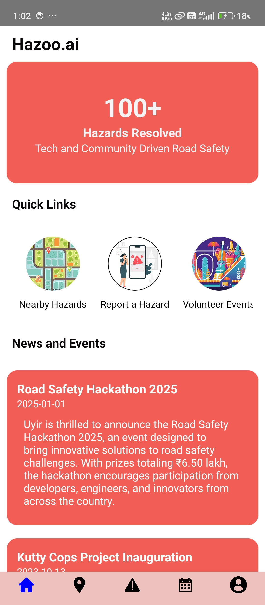
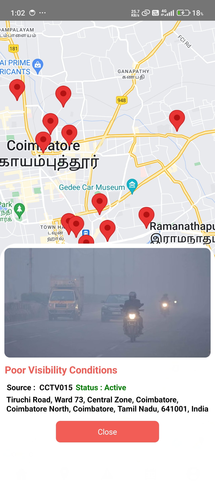
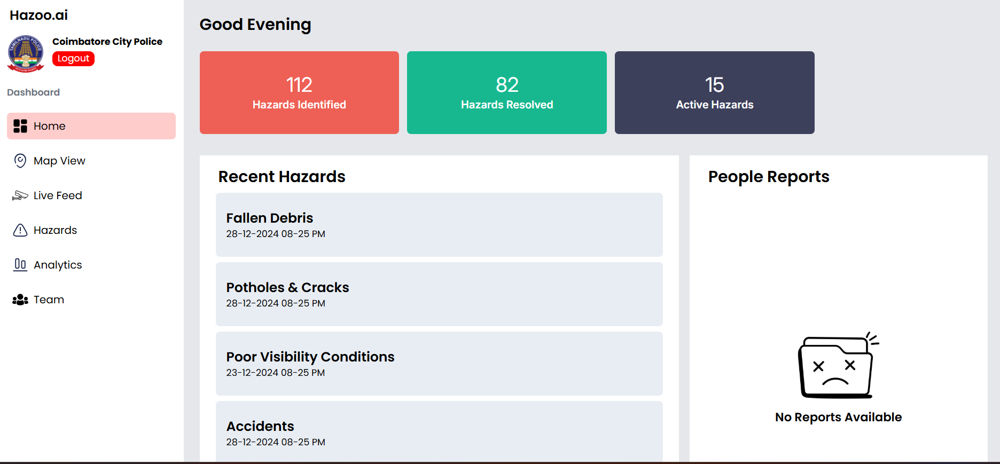
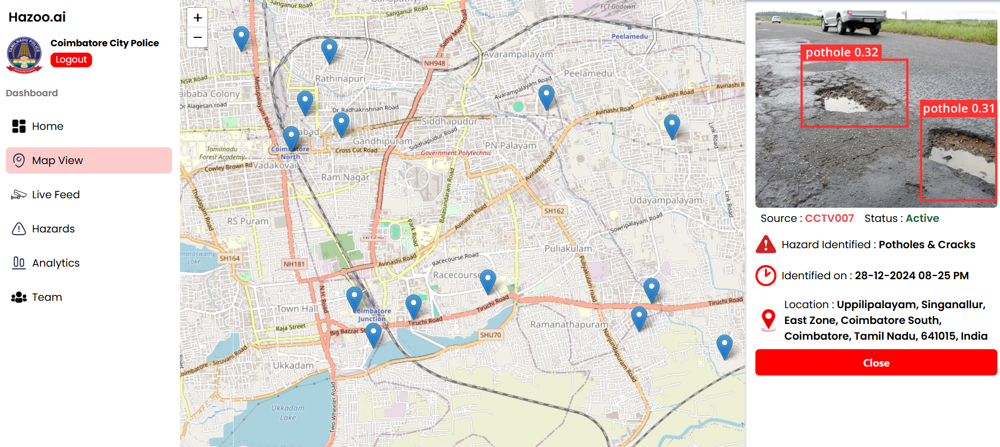
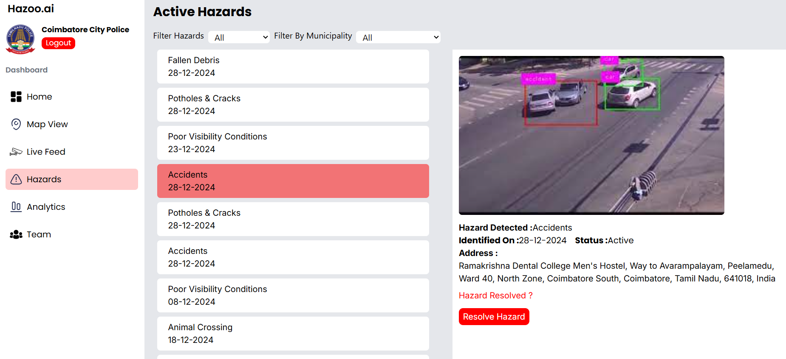

#  Hazoo.ai - Deep learning based Road Hazard Detection With Platform For Gov Officials and A mobile App for Citizens for Community Reporting

## Web Dashboard for Officials

## Overview

- Hazoo.ai is a deep learning-based road hazard detection system that provides a platform for government officials and a mobile app for citizens to report community hazards.
-  The system uses computer vision techniques to analyze images and identify potential hazards on the road, such as potholes, debris, or other obstacles. The platform allows government officials to monitor and manage reported hazards efficiently, while the mobile app enables citizens to contribute to community safety by reporting hazards in real-time.
- This project aims to enhance road safety and improve the overall quality of transportation infrastructure through advanced technology and community engagement.

## Dataset Link - https://www.kaggle.com/datasets/rajdalsaniya/pothole-detection-dataset/data?select=train